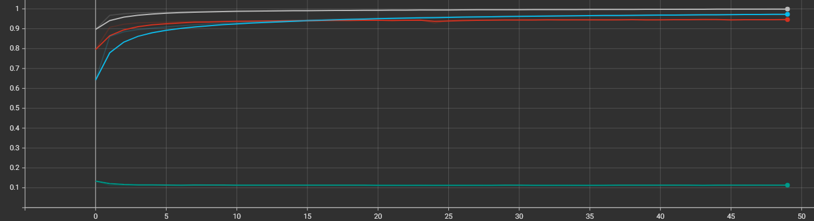
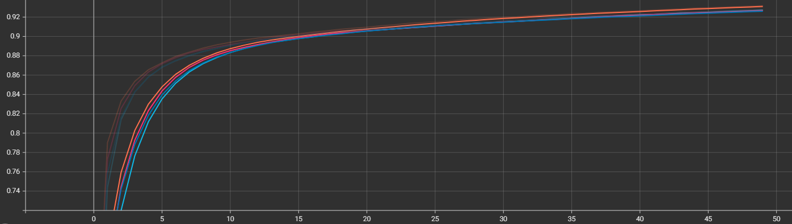
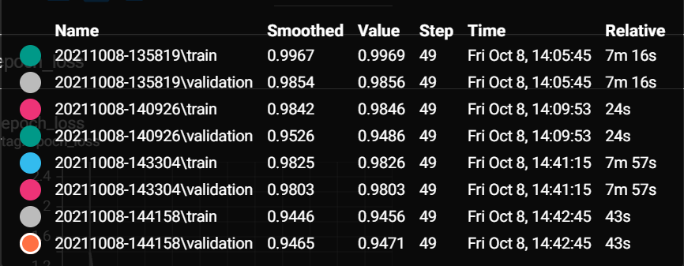
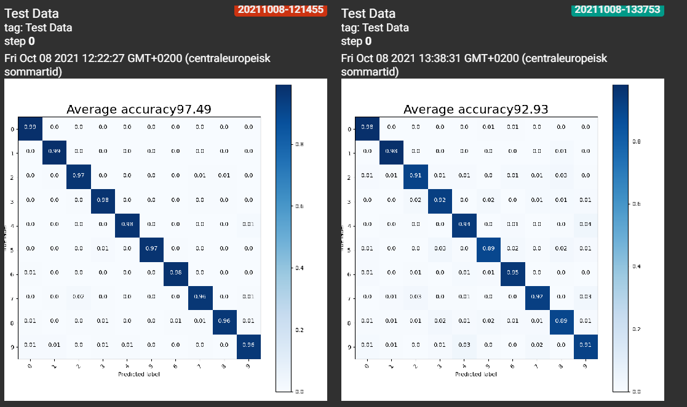
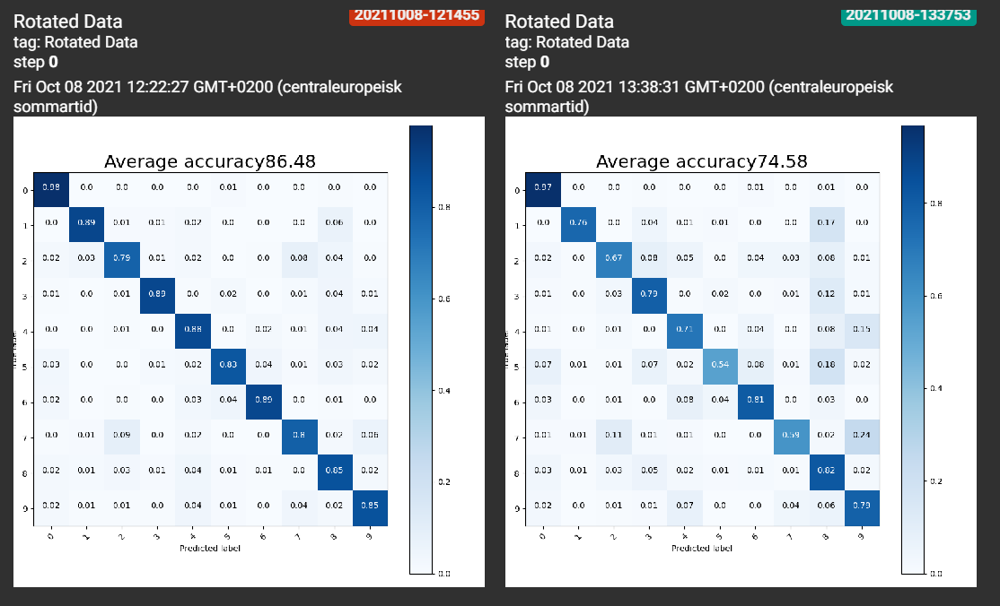
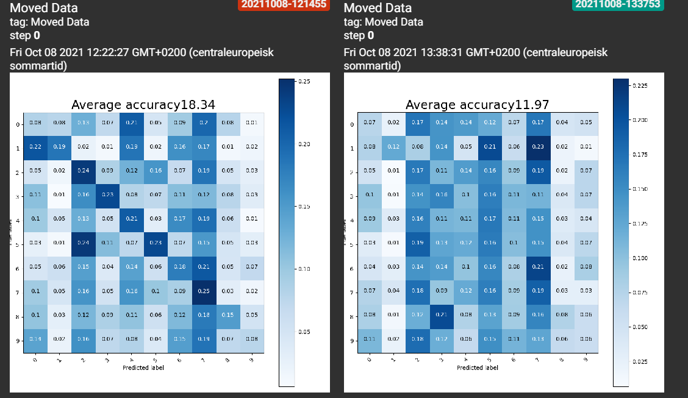

# Här är mina resultat hittils:

I den här filen ska ni beskriva:
- Era experiment
- Era slutsatser

## Glöm inte!

Glöm inte att ha med figurer:

 "Glöm inte att kryssa i 'Show data download links' så att ni kan ladda ner era filer.")

7
a) 

Det finns ingen större tidsskillnad på LR. Ju större LR det är desto snabbare tränas modellen.
Medan ett för stort värde kan leda till att man lär sig en suboptimal för snabbt eller att det blir en instabil träningsprocess.
Första bilden är för Conventional med LR = 0.01, 0.3, 0.6 samt 0.9  

Blå = 0.01 
Grå = 0.3
Röd = 0.6
Grön = 0.9

Andra bilden är Non-Conventional med LR = 0.01, 0.3, 0.6 samt 0.9

Mörkblå = 0.01
Rosa = 0.3
Orange = 0.6
Turkos = 0.9

b) 

Där är en stor skillnad om man kollar till Accuracy av testerna och "Batch-Size". Ju större size desto mer uppdateringar blir det och på så sätt mer "accurate" men det kan också leda till dålig generalisering. 
Om man istället har mindre batch-size blir det mindre uppdateringar och det kan leda till att modellen inte går samman. 

c) 

Non-Conv är väldigt snabb jämfört med Conv modellen. Men samtidigt så har Conv modellen lite högre accuracy än vad Non-Conv har. 

Conv modellen bevarar förhållandet mellan pixlar genom att lära sig bildfunktioner med små kvadrater av inmatade data samtidigt som de använder flera lager på bilder och använder filtrering för att analysera bildinmatningar.  

Non-Conv är rader med datapunkter som genom neuroner använder samma nätverk. De använder också vikter för att lära sig och vikterna ändras efter varje iteration. 

d) 

Både non-conv och conv ger dåliga resultat på "Moved Data" testseten. conv ger ett resultat på snitt 18, non conv ligger nere på 12. På de roterade testsetten ger conv en accuracy på 86, vilket är 10 under de vanliga. non-conv hamnar på 75, vilket är ungefär 14 under de vanliga. 
Det är samma skillnad mellan de olika testseten för båda nätverken. 

e) 

Non-Conv modellen:
Med lr = 0.01
Bath-Size = 256
Accuracy ökade succesivt när det lades till neuroner i det "gömda lagret" tills det uppnådde ungefär 320 antal neuroerna efter detta så låg accuracyn på samma nivå som var ungefär 
0.9420 väldigt länge ungefär till över 1000 neuroner efter det kunde man se skillnad igen. Accuracyn stagnerade och höll samma kurs när den var 4000+.

f)

från att analysera flera olika "kernesize" med olika "strides" fann vi att de som gav minst påverkan på resultatet men fortfarande och mycket bättre tid va kernal (14,14) strides (4,4).

Kernal	Stride	tid	    acc moved	acc rot	    acc
14,14	4,4	    0.56	21.21	    82.46	    95.15

g) Ju fler lager som lades till desto längre tog tiden för att genomföra testet men samtidigt ökade accuracyn. 