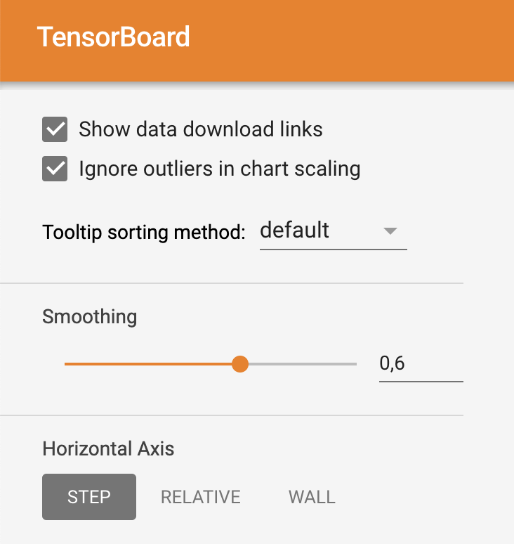

# Här är mina resultat hittils:

I den här filen ska ni beskriva:
- Era experiment
- Era slutsatser

## Glöm inte!

Glöm inte att ha med figurer:

7
a) Det finns ingen tidsskillnad på LR, mne om LR är för hög så blir non_conv resultatet skakigt med överlag hög "rätt". conv med hög LR får väldigt lågt värde och lär sig ej.

b)