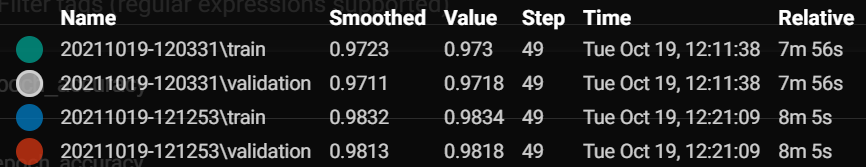

# Här är mina resultat hittils:

I den här filen ska ni beskriva:
- Era experiment
- Era slutsatser

## Glöm inte!

Glöm inte att ha med figurer:

 "Glöm inte att kryssa i 'Show data download links' så att ni kan ladda ner era filer.")

7
a) 

Det finns ingen större tidsskillnad på LR. Ju större LR det är desto snabbare tränas modellen.
Medan ett för stort värde kan leda till att man lär sig en suboptimal för snabbt eller att det blir en instabil träningsprocess.
Första bilden är för Conventional med LR = 0.01, 0.3, 0.6 samt 0.9  

Blå = 0.01 
Grå = 0.3
Röd = 0.6
Grön = 0.9

Andra bilden är Non-Conventional med LR = 0.01, 0.3, 0.6 samt 0.9

Mörkblå = 0.01
Rosa = 0.3
Orange = 0.6
Turkos = 0.9

b) 

Det fins en skillnad om man kollar på accuracy och tid på tester med olika batch-size, sänker man batchSize till 128(som man ser på testet) ökar både tiden det tar och hur accurate den är. 

Grön/grå är batch 256
Blå/röd är batch 128

c) 

Non-Conv är väldigt snabb jämfört med Conv modellen. Men samtidigt så har Conv modellen lite högre accuracy än vad Non-Conv har. 

Conv modellen bevarar förhållandet mellan pixlar genom att lära sig bildfunktioner med små kvadrater av inmatade data samtidigt som de använder flera lager på bilder och använder filtrering för att analysera bildinmatningar.  

Non-Conv är rader med datapunkter som genom neuroner använder samma nätverk. De använder också vikter för att lära sig och vikterna ändras efter varje iteration. 

d) 

Både non-conv och conv ger dåliga resultat på "Moved Data" testseten. conv ger ett resultat på snitt 18, non conv ligger nere på 12. På de roterade testsetten ger conv en accuracy på 86, vilket är 10 under de vanliga. non-conv hamnar på 75, vilket är ungefär 14 under de vanliga. 
Det är samma skillnad mellan de olika testseten för båda nätverken. 

e) 

Non-Conv modellen:
Med lr = 0.01
Bath-Size = 256
Accuracy ökade succesivt när det lades till neuroner i det "gömda lagret" tills det uppnådde ungefär 400+ antal neuroerna efter detta så låg accuracyn på samma nivå som var ungefär 
0.9760

f)

från att analysera flera olika "kernesize" med olika "strides" fann vi att de som gav minst påverkan på resultatet men fortfarande och mycket bättre tid va kernal (14,14) strides (4,4).

|Kernal	|Stride	|tid	|acc moved	|acc rot	|acc    |
|-------|-------|-------|-----------|-----------|-------|
|14,14	|4,4	|0.56	|21.21	    |82.46	    |95.15  |

g) Ju fler lager som lades till desto längre tog tiden för att genomföra testet men samtidigt ökade accuracyn. Vid 3-4 gömda lager uppnådes bästa precision där tiden inte var markant hög.

8

|Test    |Kernal    |Stride  |lr	  |tid	   |acc moved	|acc rot	 |test acc    |train acc   |relu lager    |batch Size |
|--------|--------  |--------|--------|--------|------------|------------|------------|------------|--------------|---------- |
|1       |14,14     |4,4     |0,3     |2:58    |25,76       |90,67       |98,57       |99,68       |128+64+32     |128        |
|2       |14,14     |4,4     |0.3     |2:30    |26,7        |89,87       |98,46       |99.66       |128+64+32     |256        |
|3       |10,10     |2,2     |0,3     |11:07   |24,06       |91,91       |98,94       |99,75       |128+64+32     |128        |
|4       |14,14     |4,4     |0,3     |2:48    |26,41       |87,37       |97,57       |99,06       |128+64+32+16  |128        |
|5       |14,14     |3,3     |0,3     |2:17    |21,66       |85,18       |97,33       |98,61       |64+32+16      |128        |

Test 1 ger bästa resultat. 
Från de tidigare testarna fann vi att lr ger bäst resultat och använde oss då och den i alla tester. 
Kernal och stirdes gav snabbast och mest accurate resultat på 14,14-4,4 vilket är anledningen till varför de användes på 3/5 tester. Vi testade också några andra värden på kernal och stride, då det finns många olika värden att testa på där och vi försökte öka accuracy och offra lite tid och viseversa. 

1)
På test 1 använde vi oss av en lägre batch size dessutom eftersom det gav bättre precision när vi undersökt tidigare. Tillsammans med de andra olika värdena som gav bäst resultat landade vi i detta. Vi använde oss av 3 gömda lager då detta gav bäst resultat när vi jämförde tiden -> precision.

2)
För att vara helt säkra på om vi gjort rätt provade vi exakt samma värden men med "orginal" bath-size för att kunna utesluta detta helt och att en mindre batchsize gav bättre resultat där tiden inte var markant förändrad.

3)
I våra testresultat fick även kernal size (10,10) med strides (2,2) väldigt bra precision. Men precis som vi anade skulle hända var det en väldigt stor tidsskillnad jämfört med de andra resultaten. 

4)
För att säkerställa vilket som var bäst utav 3 eller 4 gömda lager provade vi även med 4 gömda lager för att kunna vara helt säkra på vår sak.

5)
Vi försökte även tweaka lite i strides för att se om detta kunde ge någon bättre effekt och på så sätt få ut den bästa modellen.